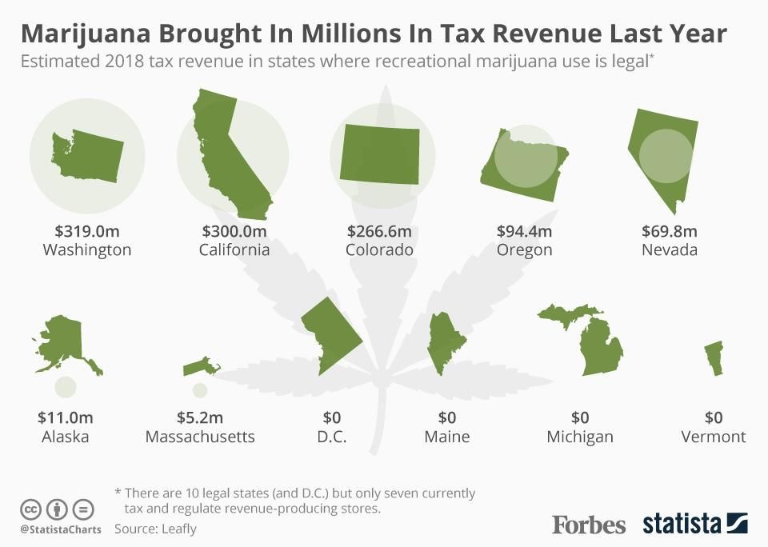

## Recreational Marijuana Legalization (RML)
Traffic collisions could be one of the most devastating things for families and lives. Each year, more than 10,000 lives are claimed because of driving under influence (DUI). In 2016, California passed the Adult Use of Marijuana Act (AUMA), and legalized recreational use of marijuana (RML). This might be beneficial for tax revenue

but it might be harmful in traffic related scenes. We suspect that marijuana would bring a negative impact on California traffic collisions' DUI cases. This project focuses on establishing a causal relationship between RML and DUI rate using California and South Dakota’s collision data. In South 	Dakota, marijuana is fully illegal. Our hypothesis is that RML would increase the DUI rate in California because of the relaxation of the use of marijuana compared with the state where marijuana is not legalized.

Explore More:

[DUI vs. DateTime](./pages/datetime.html)

[Confounder and Possible Effects](./pages/cofounder.html)

[Model](./pages/model.html)

[Source](./pages/source.html)
