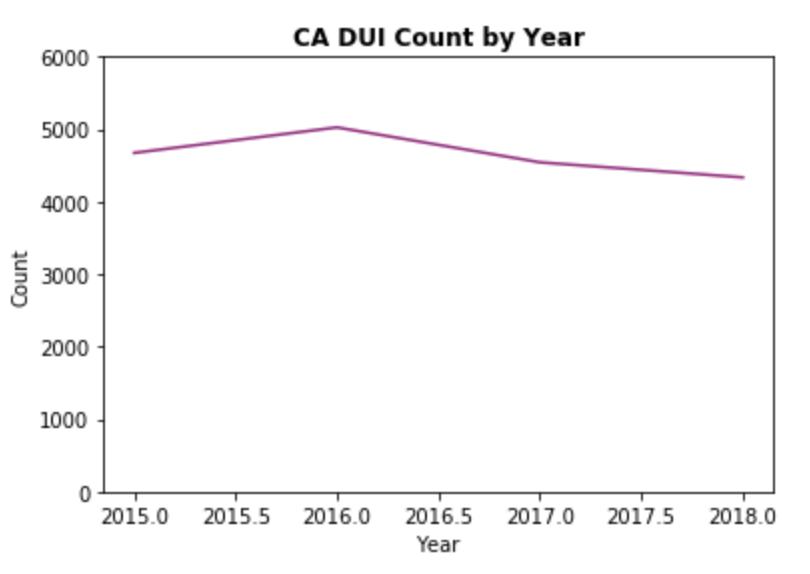
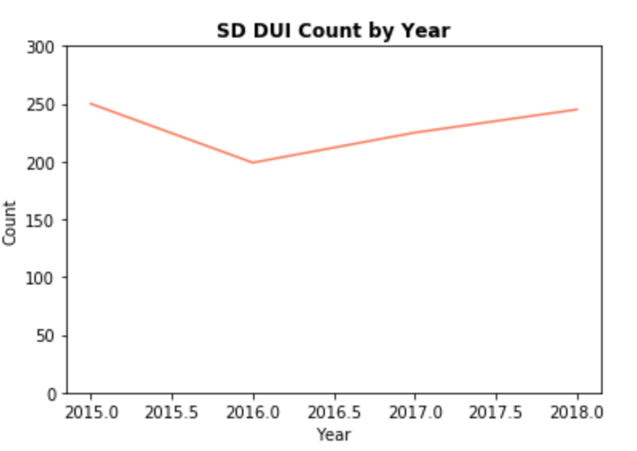

# DUI vs DateTime
## DUI Count by Year
For California, a big increase in around 2016 can be observed and the counts decrease since 2016. However, for South Dakota, a big decrease in 2016 can be observed and the counts increase since 2016. The reason behind the decrease/increase will be analyzed and whether the change in California was caused by RML or not will be observed.

## DUI Rate by Year
The below graph illustrates the DUI rate of all collisions in each state by year. DUI rate is calculated by the number of collisions caused by DUI over the total number of traffic collisions.

[pic]

## DUI Count by Year and Month
When looking at the specific count of DUI cases by month and year, the year 2016 had more accidents than others, and month does not seem to be a confounder in the analysis since during each year the monthly change does not exceed 33%. There are slight increases in the summertime compared to winter when people are more likely to be under influence. A new initiative in policies may impact on a finer level, thus it is crucial to examine changes by month. RML essentially does not significantly impact the number of people making the decision to drive in such a manner, even when marijuana was not legalized.

South Dakota is not as populated as California, thus there are fewer cases when it comes to counting, but in the summertime, people do tend to have more DUI accidents, probably due to all the outdoor parties in better weather, unlike the year-round slightly milder weather in California. Overall people in both states still tend to have more accidents in summer.

[pic]
[pic]

## DUI Count by Day of Week and Time
On a more granular level, the day of the week and time of collision do contribute to the number of collisions, given that these are significant factors in terms of traffic volume, which are directly related to collisions. Each Friday tends to be the day with the most traffic collisions, while the hours around weekend midnight are the hours with the most DUI accidents, perhaps when people just finished partying and going home, they decide that they might get away with it.

<iframe src="../assets/datetime_page/ca_heat1.html" style="border:0px #ffffff none;" name="myiFrame" scrolling="yes" frameborder="0" marginheight="0px" marginwidth="0px" height="700px" width="49%" allowfullscreen></iframe>

<iframe src="../assets/datetime_page/sd_heat1.html" style="border:0px #ffffff none;" name="myiFrame" scrolling="yes" frameborder="0" marginheight="0px" marginwidth="0px" height="700px" width="49%" allowfullscreen></iframe>

## DUI Count by Month and Day
<iframe src="../assets/datetime_page/ca_heat2.html" style="border:0px #ffffff none;" name="myiFrame" scrolling="yes" frameborder="0" marginheight="0px" marginwidth="0px" height="700px" width="49%" allowfullscreen></iframe>

<iframe src="../assets/datetime_page/sd_heat2.html" style="border:0px #ffffff none;" name="myiFrame" scrolling="yes" frameborder="0" marginheight="0px" marginwidth="0px" height="700px" width="49%" allowfullscreen></iframe>

[back](../index.html)
