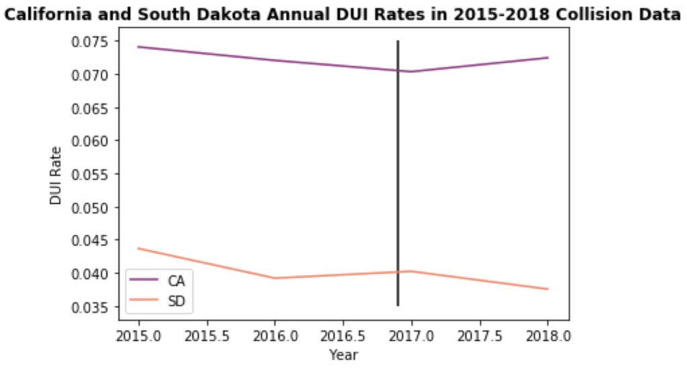
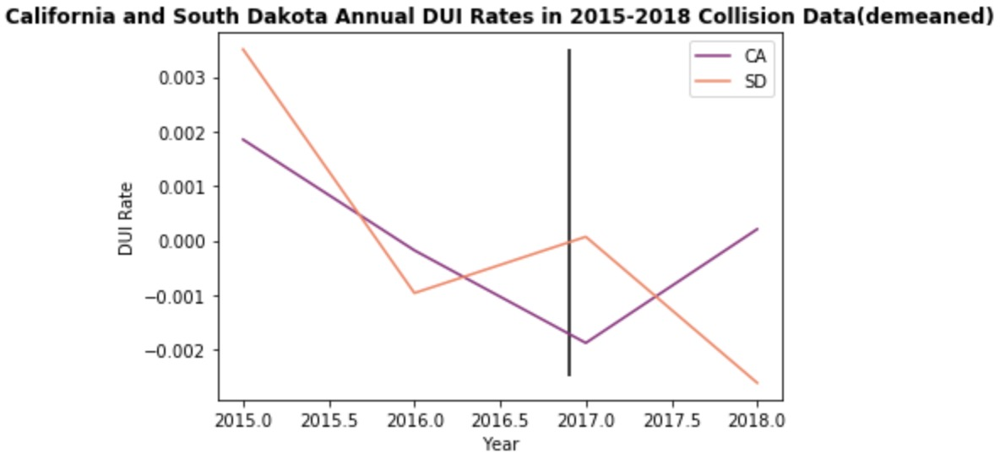
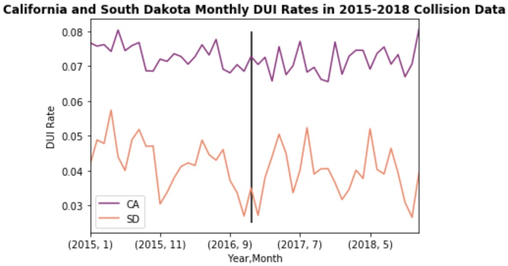
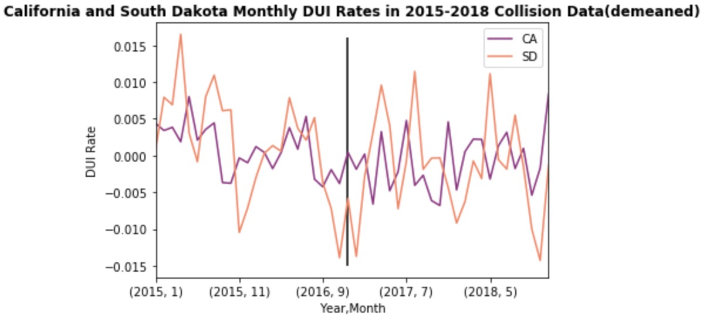
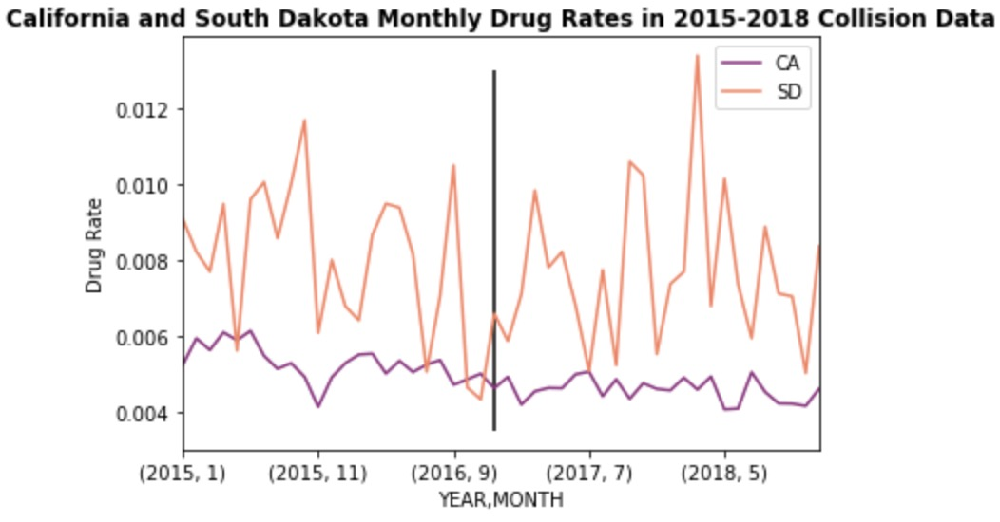

# Difference in Differences(DD) Model
## Motivation
The Difference in Differences(DD) model could be one of the most popular techniques to evaluate the effectiveness of certain policies in social sciences and econometrics. It tries to apply experimental design on existing panel data(time spanned data) by assessing the differential effect between the targeted treatment group, for which the studied policy takes place and a comparable control group, for which the policy is not implemented. The advantage of this model is that it would establish causal relationship between the explanatory variable and the response variable. In this case, whether legalizing recreational marijuana would lead to an increase in DUI rate in California or not. By adopting this technique, we would, to a certain degree, mitigate or avoid some selection bias and confounding factors that would bring misconceptions on the true impact that solely based on the policy towards the treatment group. The model uses the equation below to find out the differential effect:
yit = α + β * treatment + γ * post + δ * (treatment * post)

where
yit= the response variable,

treatment = indicator of whether the policy takes place or not,

post = time indicator that is 1 if time is after the policy if effective or 0 if time is before the policy is effective.

Our benchmark model uses these definitions to investigate our problem and δ, the coefficient of  the interaction variable between treatment and time is the key to tell whether the policy brings statistical significance to the treatment group.

Below, the table explains why δ is critical and why the name of this technique is called difference in differences:

|                          | Before Policy Implemented (post = 0) | After Policy Implemented (post = 1) | Difference |
|--------------------------|--------------------------------------|-------------------------------------|------------|
| Treatment (treatment =1) | α+β                                  | α+β+γ+δ                             | γ+δ        |
| Control (treatment = 0)  | α                                    | α+γ                                 | γ          |
| Difference               | β                                    | β+δ                                 | δ          |

By examining the differential effects on two groups, we could eliminate other factors that potentially influence our treatment group. By testing out whether δ is significant or not, we would be able to establish a causal relationship that is solely based on our interest variable with the response variable.

## Preparation EDA for DD model
In order to test out the impact of RML on California, we need to find our control group to see the sole influence of marijuana rather than intricate confounding variables. After analyzing lots of other states’ collision data, we find South Dakota's data fit for our framework. South Dakota has not legalized marijuana for any purpose yet and the proportion of DUI caused collision cases to follow a similar pattern in California before the time of California’s RML process. The Difference in Differences model relies on the assumption of a common trend, for which it asks the trend in both treatment and control place before a policy implemented should be roughly the same.

First, we plot the annual DUI rates of collisions data for both groups. They both show a downward trend, but the rate is different in a constant value. We further transform the data by subtracting the mean for both groups.

After demeaning the data, we see the two groups obtain a roughly similar trend before the time when RML in California(black vertical line). In that case, we would be able to perform Difference in Differences on this set of data.

If we continue to explore the data by plotting the monthly DUI rates, we could still see the common trend property hold for these two datasets. The difference in the rates by a constant value still remains a problem. We will perform the same technique for the annual DUI rates by demeaning the two data.

After demeaning the data, we find South Dakota’s data is less volatile compared to California’s. This might cause a less robustness of the model but overall the trends are almost the same and this control group could be one of the best data we could find for now.

## Result

[back](../index.html)
