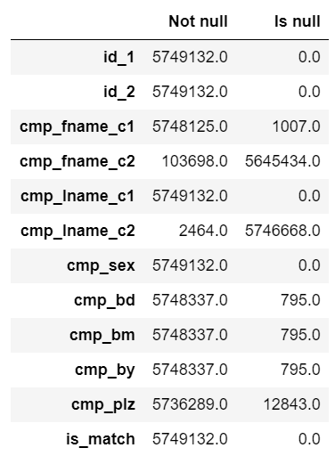
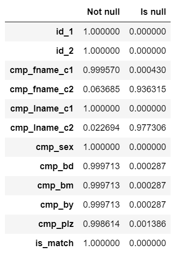
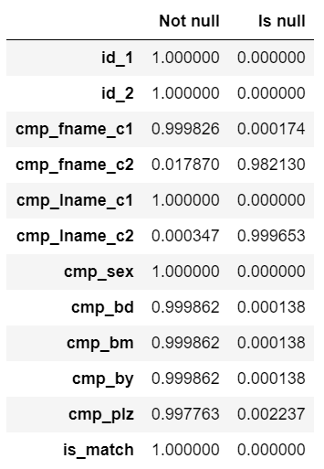
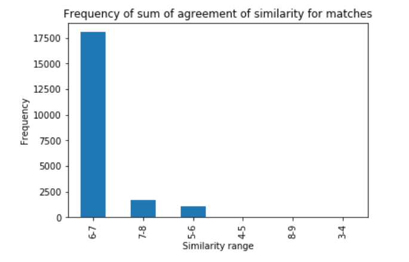
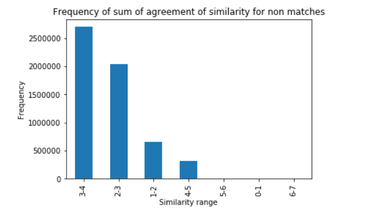
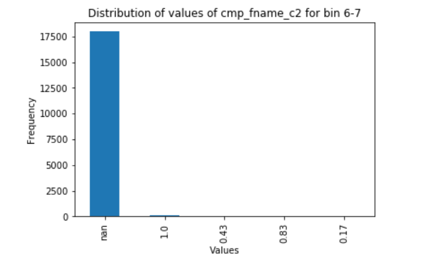
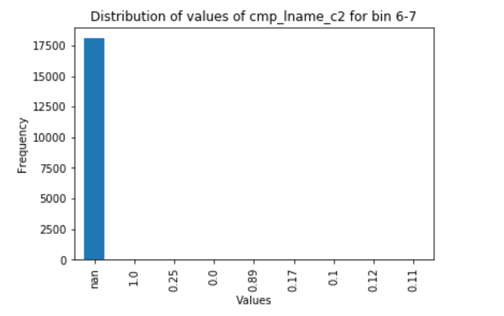

- For Checkpoint 1:
	- All members - revised proposal
	- Udai: Create code for generating datasets with strong keys (and varying noise)
	- Shinu: Clean and perform EDA on our real-world datasets
	- Wesley: Finalize Structure of our Heterogenous Graphs
		- determine method for representing graphs (on disk)
		- determine method for using quantitative attributes.

\pagebreak

### Our Task & Data

The task we are looking to progress is record linkage using heterogenous graph structures. The applications of this are widespread; however due to limited research specifically on our topic, we are going to be using a "toy" record linkage dataset used to baseline general record linkage algorithms.

Also, we are going to be generating artificially generated datasets to periodically test our pipeline. The artificial datasets will allow us to control how stochastic our datasets are and if there is an existence of a strong key. The heterogenous graph structure we are looking to make is agnostic to the "type" of the data within the dataset, therefore a fake dataset with categorical attributes will work as a satisfactory stand-in for our task.

Also, due to it being unclear on the challenges that may come while constructing this pipeline, the ability to make artificial datasets allows us to test more quickly and dynamically scale the size and scope of the data. We feel that this flexibility will be vital for the success of our project.

### Artificial Dataset Generation

For the artificial dataset generation, we create datasets that are parameterized by:

1. number of rows
2. number of columns
3. number of strong columns
4. randomness parameter $0 < p < 1$
5. maximum number of categories

The number of rows allows us to dynamically scale up our project. By testing our pipeline on smaller inputs, we will able to identify and address problems on a smaller scale before attempting to increase the scope of the project. For example, a question that we hope to address is whether our model will be able to effectively capture a composite strong key within the fake dataset.

Also, the parameter for the maximum number of categories will allow us to see how our models performs in sparser representation. For example, as the number of categories grows, we would expect the performance of the model to suffer. However, this would allow us to characterize this relationship more precisely.

Lastly, the randomness parameter will allow us to see how our model performs relative to noise. We created a conditional distribution between adjacent columns. Based on the randomness parameter, we will either choose to follow this conditional distribution or place a random value. If the randomness parameter is 0, then adjacent columns are very highly conditionally dependent. However, if the randomness parameter is 1, then all columns apart from the strong columns are noise.

The main concern over this process is that it will not generalize to the real-world datasets. We attempted to encode the idea of conditional dependence between columns, however this only represents the dependence between 2 columns. This obviously does not correspond to reality, in which dependencies can be complicated and found between multiple columns. However, we feel this will likely perform as a placeholder to help resolve some basic issues in our model before attempting to apply the model onto real data.

### Exploratory Data Analysis

The exploratory data analysis that we will be doing is focused on a real world dataset donated by Epidemiologisches Krebsregister NRW. The dataset contains 5,749,132 records where each row represents two rows in a sample dataset of 100,000 records that have been compared for matches using nine similarity measures.

The nine similarity measures and their respective columns in our dataset are:

1. cmp_fname_c1: agreement of first name, first component
2. cmp_fname_c2: agreement of first name, second component
3. cmp_lname_c1: agreement of family name, first component
4. cmp_lname_c2: agreement of family name, second component
5. cmp_sex: agreement of sex of individual
6. cmp_bd: agreement of date of birth, day component
7. cmp_bm: agreement of date of birth, month component
8. cmp_by: agreement of date of birth, year component
9. cmp_plz: agreement of postal code

The datasets also provides true or false labels that tell us if the two records are a match or not. This is fairly reliable as this was determined during an extensive manual review of the dataset where several documentarists were involved. Hence, we have a ground truth value that we can use to check our models accuracy to solve the problem of record linkage.

One of the first surveys done on the dataset was to find the number of missing attributes in each column.

{ width=40% }

The above table shows that two columns, cmp_fname_c2 and cmp_lname_c2, have a large number of missing attribute. Missing attributes mean that it will be impossible to check the similarity of the attribute for that particular record against other records and this could result in increasing the difficulty of finding matches.

In order to see this effect, we took a look at the distribution of the missing attributes in the correctly matched records and records that are not a match.

| Matching Null Distribution        | Non-Matching Null Distribution           |
| ------------- |:-------------:|
| { width=30% }     | { width=30% }|

The two tables show that the distribution of missing values in each column, whether they are matched or not, are pretty similar. This means that the missingness is almost equally balanced for records that are matched and those that are not matched. This shows that there is no bias in the way the missing attributes are spread out between matched and not matched records.

Next, we decided to check the overall sum of similarity per record. In order to do this, we converted the missing values to 0. This is because it would be hard to estimate a value as we have no way of knowing the original value.
We summed the columns by row and binned the values into bins of 0-1, 1-2, 2-3, 3-4, 4-5, 5-6, 7-8, 8-9. We proceeded to plot the distribution of these bins for matched and not matched columns.

| Similarity Matching        | Similarity Non-Matching           |
| ------------- |:-------------:|
| { width=50% }    | { width=60% }|

The plots show us that records that are matched together tend to have a high sum of similarity. There are a 56 outliers from the unmatched records that manage to reach the 6-7 range bin and 13 matched records that fall into the 3-4 bin, however this number is very miniscule. Hence, it should be fairly easy to differentiate between a matched record and an unmatched record.

An exploration of the attributes of the matched records that fall into the 6-7 bin shows that cmp_fname_c2 and cmp_lname_c2 play a large role in the drop of its similarity score.

The exploration of the missing and similarity values show us that there are two main correlations: 1. a high sum of similarity generally means that the two record are match, 2. high number of missing values tend to result in a low sum of similarity. Hence, it should be possible to predict if two records are matches or not in this dataset by creating a model that takes these correlations into account.

|          |             |
| ------------- |:-------------:|
| { width=53% }    | { width=50% }|

The rows that fall in the 6-7 bin have a large number of missing values in the cmp_fname_c2 and cmp_lname_c2. If these two columns were not missing, the records could have had much higher similarity measures. Hence, this proves that missing attributes play a large role in determining if two records are a match or not.

### Quantitative Variables in Heterogenous Information Networks

A main concern of feature representation in graphs is how we can encode quantitative variables. Specifically, this is necessary for record linkage, as we need to encode proximity between quantitative variables to effectively link entities together that share similar features in quantitative columns. For the baseline, we will be rounding numerical columns and encode the graph such that there will be an edge between two entities if they share the same rounded numerical value.

Another method we could choose is binning numerical columns and connecting entities with edges their numerical columns have values that are in the same bins. While this creates a coarser view of the data, it allows for more leniency in terms of a closeness metric and can allow for connections between entities even when they do not share the same values in their quantitative variables. This can allow room for error in clerical errors (e.g. accidentally inputting 4 instead of 3). Binning and other similarity metrics will be toyed with as we scale up our project.

### Schema

As with the malware detection project, having an efficient method of storing the heterogenous graphs creates is crucial for the project pipeline. In a similar fashion to how graphs were stored and represented in the Hindroid
paper, we will be using adjacency matrices to store our graphs. As explained in the proposal, we will have 3 graphs to store: $G_{E}$, $G_{EA}$, and $G_{AA}$, which correspond to entity to entity, entity "is a" attribute, and attribute to attribute. In the medical record dataset, $G_{E}$ is readily defined with ground truth labels already - we can create a matrix with an entry of 1 if row i and column j represent the same entities and 0 otherwise. $G_{EA}$ can best be defined for sex - we can create a matrix with an entry of 1 if row i and column j are in agreement of the sex label and 0 otherwise. $G_{AA}$ will likely comprise of the date of birth and name data, since those day/month/year of birth and first name / last name columns are naturally interconnected.

These graphs we defined will need an efficient physical storage solution as well, as matrices of 5 million by 5 million rows are unlikely to be easily manipulated in matrix multiplication for creating metapaths later down the line. We can store matrices created in intermediate files like csv files, but we will still need to deal with the physical limitations of computing large matrix operations. As such, we will be working on ways to scale down these graphs and hence their adjacency matrices moving forward.

With the artificial dataset, our graphs will be defined based on the parameters we pass in. We will store the graphs in adjacency matrices, but these matrices will be defined based on the artificial dataset we choose to generate. It's worth noting that we will likely work on this generated dataset first in order to test our heterogenous graph structures and project pipeline before scaling up to the medical record dataset.

### Works Cited:

1. https://www.cse.ust.hk/~yqsong/papers/2017-KDD-HINDROID.pdf
2. http://archive.ics.uci.edu/ml/datasets/Record+Linkage+Comparison+Patterns

\pagebreak

### Revision to the Proposal

We currently don't feel there needs to be any major revisions to the proposal.

### Backlog:

- For Checkpoint 1:
	- All members - revised proposal
	- Udai: Create code for generating datasets with strong keys (and varying noise)
	- Shinu: Clean and perform EDA on our real-world datasets
	- Wesley: Finalize Structure of our Heterogenous Graphs
		- determine method for representing graphs (on disk)
		- determine method for using quantitative attributes.

- For Checkpoint 2:
	- Generate Heterogenous Graphs (Udai)
	- Train baselines Models (Wesley)
		- perform tests over a subset of generated datasets
	- Clean real dataset and transform in a usable format (Shinu)
	- Stretch Goal: Train/Evaluate Hindroid Model using our data (everyone)
