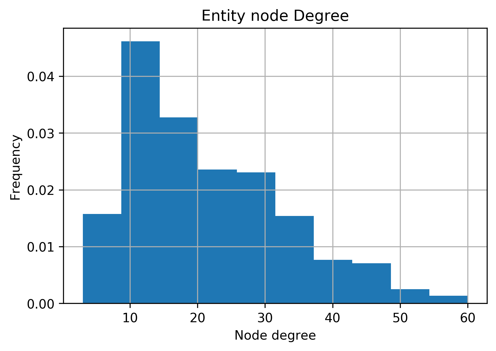
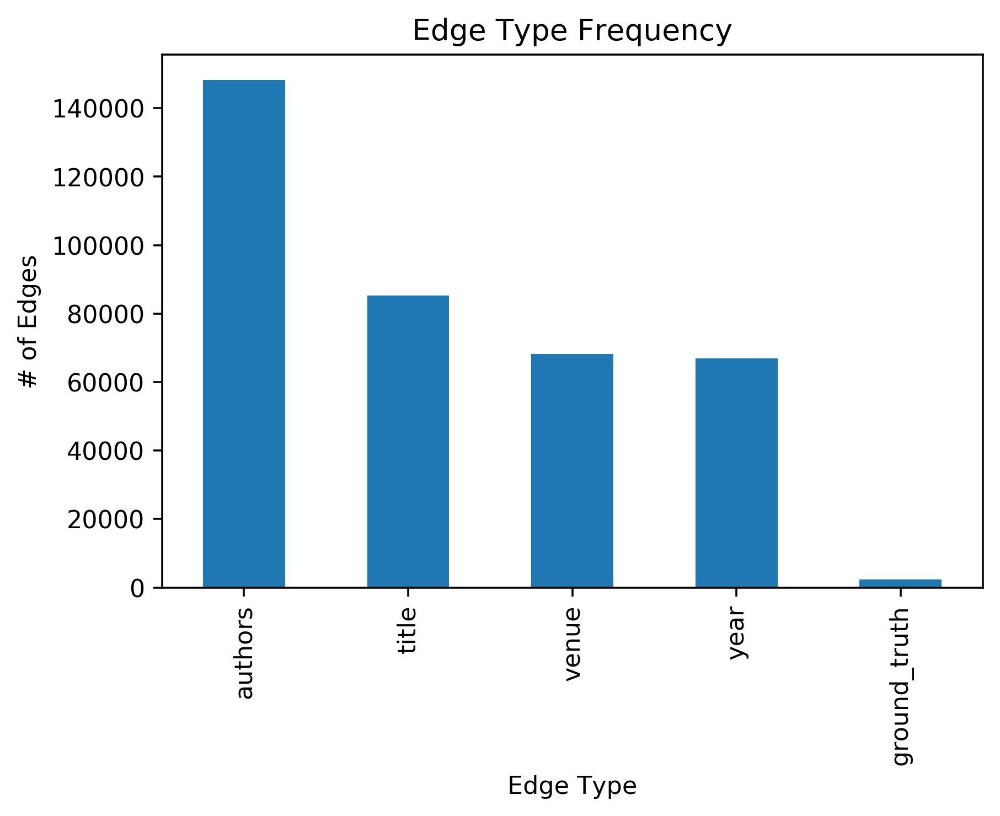

- For Checkpoint 2:
	- All members - performed EDA
	- Udai: Performed EDA on smaller datasets & transformed in graphs.
	- Shinu: Cleaned and performed EDA on datasets
	- Wesley: Created Baselines for future model testing

\pagebreak

# Problem Statement

The problem we are looking to solve is the issue of record linkage, which is the process of relating entities within different datasets. After further data ingestion and EDA, we have decided to use a dataset with papers and authors, where we will use heterogenous graph techniques to perform entity resolution. In addition, we have gathered smaller, similar datasets to test our implementation and methods.

# Datasets

For this project, we are going to be using a large dataset from [Kaggle](https://www.kaggle.com/c/kdd-cup-2013-author-disambiguation/rules) and four smaller datasets from [Leipzig Universities Database Department](https://dbs.uni-leipzig.de/research/projects/object_matching/benchmark_datasets_for_entity_resolution). The goal is to analyze the smaller datasets from Leipzig university in order to verify the validity of our implementation, as well as resolve the glaring issues that may arise within the model.

# Author Disambiguation Dataset

The Author Disambiguation Dataset from [Kaggle](https://www.kaggle.com/c/kdd-cup-2013-author-disambiguation/rules) is a group of five datasets that were provided by Microsoft Corporation from their Microsoft Academic Search Database in order to try to find ways to solve disambiguation problems present in datasets.

The five datasets are:
1. Author dataset (Author.csv)
This dataset contains information on publication authors in the Academic Search Database. It contains Author ID, name and affiliation of the author.
Number of instances - 247,203
2. Paper dataset (Paper.csv)
The paper dataset contains information on the papers available in the Academic Search Database. It contains Paper ID, Title of the paper, Year published, Conference ID, Journal ID and keywords. The dataset is very noisy with the possibility of the same paper appearing multiple times in the dataset as it may have been obtained through different data sources.
Number of instances - 2,257,249
3. Paper-Author Dataset (PaperAuthor.csv):
The paper author dataset contains paper id and author id pairs. The dataset is very noisy as it contains possibly incorrect paper-author assignments due to author name ambiguity and variations of author names.
Number of instances - 12,775,821
4. Journal and Conference dataset (Journal.csv, Conference.csv):
These datasets contain additional metadata on the papers dataset. Each paper can be either a conference or journal and some of the paper may not be associated with either.
Number of instances in the journal dataset - 4,545
Number of instances in the conference dataset - 15,151

The paper, author and paper-author datasets, that are very important for our problem, varying degrees of missingness for each of its columns.

{ width=30% }

As shown by the above bar chart, the authors dataset has the highest number of missing values(60%) in the affiliation column. The name column comes in second with only 7 percent of its data missing. The ID column has no missing values.

{ width=30% }

The paper dataset has the highest number of missing values(76%) in the keyword column. The title column has the second highest number of missing values with 7% of its data missing. The other columns do not have any missing values.

{ width=30% }

The affiliation column in the paper-author dataset has the highest number of missing values(65%). The only other column in the dataset that has any missing values is Name. Only 0.002 percent of the Name attribute is missing.

The missing values in the columns will play large part as more missing values result in it being harder to classify a link between records.

# Smaller Datasets

## Introduction

The four smaller datasets that we will be looking at are from [Leipzig Universities Database Department](https://dbs.uni-leipzig.de/research/projects/object_matching/benchmark_datasets_for_entity_resolution). Each dataset is sampled from real world examples and the noise in each one varies differently. These datasets are primarily used as benchmarks for testing different entity resolution techniques hence, they will be ideal to evaluate our model. In particular, two of these datasets are directly associated with the Author Disambiguation Dataset we will be using for our final implementation, as these datasets deal with linking books and authors. The following datasets following a similar format, comprising of two separate datasets and a file that describes the matching entities between the two datasets.

## Abt-Buy

This dataset is two separate datasets of with 1081 and 1092 instances of purchasable items with names and description, but without a clear link between the two datasets. Most of the data within this dataset is textual, apart from a price column. However, the price column is the most dirty column in that it has NaN values. There is also an issue with the fact that the description column within the Buy dataset seems to also have many missing values. This intuitively gives means that the meaningful connections must be made between the description and the name columns.

| About Table NaN's      | Buy Table NaN's          |
| ------------- |:-------------:|
| { width=30% }     | { width=30% }|

There is also some ambiguity within the dataset. For example, there is a few examples within the dataset in which multiple entities are matched. Within this case, we want our recording linkage algorithm to be able to find that the entities are similar enough rather than being confused by the small differences. In other words, we want our record linkage algorithm to be invariant to such noise within the data.

{ width=50% }

## DBLP-ACM

This dataset comprises of two datasets: one with 2614 entries and one with 2294 entries. Both datasets contain columns with unique IDs, titles of books, authors, venue, and year. Aside from the year, the data in these two datasets is textual. Between the 2 datasets, there are 2224 ground truth matches. This dataset is extremely clean, with very little missingness. The only form of missingness arises from the authors column in one of the datasets, with 0.06% of data missing. A quick EDA through the matches also shows that this dataset only has 1-to-1 links between the two datasets.

{ width=50% }

## DBLP-Scholars

Similar to the DBLP-ACM dataset, this is a dataset with books, authors, and venues. One dataset contains 2616 entries while the other contains 64,263 entries - this is notably larger than the previous dataset. As with the DBLP-ACM dataset, both datasets in this dataset contains IDs, titles of books, authors, venue, and year. However, unlike the previous dataset, this one contains a high degree of missingness, particularly in the venue and year columns, which makes it difficult to utilize those columns in creating useful features to link entities between the two datasets together. Performing entity resolution in this dataset will require use of primarily the title and authors columns.

| DBLP Table NaN's      | Scholar Table NaN's          |
| ------------- |:-------------:|
| { width=30% }     | { width=30% }|

With this dataset, there are 5347 ground truth matches. Unlike the previous dataset, there are many 1-to-many links between entities, though this should be clear as there are almost twice as many matches as entities in one of the datasets.

## Amazon-Google Products

This dataset is similar to the Abt-Buy dataset, containing two datasets, one from Amazon and one from Google, where each row is a product. The Amazon dataset contains 1363 entries, while the Google dataset contains 3226 entries. Each dataset has columns with IDs, titles/names of products, description of the product, manufacturer, and price. In the Google dataset, there's a high number of missing values in the manufacturer column (nearly all of it is missing).

| Amazon Table NaN's      | Google Table NaN's          |
| ------------- |:-------------:|
| { width=30% }     | { width=30% }|

Like the Abt-Buy dataset, the majority of the data is textual, with the exception of price. The main objective to perform entity linkage would be perform text processing methods on the description columns. In this dataset, there are 1300 ground truth matches, with 1113 unique Amazon IDs and 1291 unique Google IDs, meaning there are 1-to-many entity matches. Unlike the book/author datasets, the titles/names of products between the two datasets rarely match each other exactly, which again reinforces the intuition that the desciption column would have to be heavily utilized to perform effective entity resolution.

{ width=50% }

## Baseline Models

Using the smaller datasets, we made some baseline models that did not depend on graphs. We used the Amazon-Google, DBLP-ACM, and DBLP Scholars dataset. Unsurprisingly, the baseline models depended heavily on the cleanliness of the datasets, as basic features, such as checking if the titles of books matched, were used. In all of the baselines, we used the ground truth matches as positive examples and randomly sampled an equal number of negative examples.

With the DBLP-ACM dataset, the baseline was performed by checking the lower case titles from both datasets, as well as checking the year, to determine whether entities matched. Since the dataset has no missing values in either of these columns, this baseline performed extremely well, getting 100% accuracy. This is to be expected given the lack of missingness as well as the lack of 1-to-many entity matches. Clearly, the data we will be using for our final implementation will not be this clean, and therefore this simplistic baseline should not perform nearly as well.

With the DBLP-Scholar dataset, the baseline was performed by just checking the lower case titles from both datasets, as the year column has a large number of missing values. While the baseline gets every negative example correct, it only gets 47% of positive examples, for a total accuracy of 73%. With a single feature, this baseline performs poorly, but it is interesting to note that simply comparing lower case titles will achieve high accuracy on negative examples.

Lastly, with the Amazon-Google dataset, the baseline was performed by checking the lower case name/title of products. This performed atrociously, getting 3.3% accuracy on positive examples, while getting all of the negative examples correct, for a total accuracy of 51%. This is to be expected, as names and titles of products between Amazon and Google are rarely exactly match. Like the DBLP-Scholar baseline, it is interesting to note that simply comparing names of products will net a high accuracy on negative examples.

\pagebreak

## Graph Descriptions

{ width=50% }

After creating the heterogenous graphs, we looked into describing the properties of the graph's nodes. We looked into finding descriptive statistics on each of the datasets separately, as well as a unified analysis between the four datasets. The four datasets are considerably smaller than the large dataset we will work with. However, they are also very similar to the large dataset we will be using in that they are very heavy on textual data. This will allow us to test our model on a scaled down version of the problem, which will allow us to iterate quickly before testing on the larger dataset, which we anticipate to be computationally much more expensive.

### Abt-Buy Dataset

|Graph Degree Frequency|Graph Edge Frequency  |
| :-------------: |:-------------:|
| { width=30% }     | { width=30% }|

Within this dataset, we found that this seems to be relating electronic products with based on a name and description. This can be seem above, which shows that there is a high cardinality within the name and description embeddings. Also, as you can see below, there seems to be some overlap within the words for the columns. We can use this heuristic when refining our graphs to match overlapping words. For example, if the word 'black' occurs within the name of 1 entity, as well as the description of the a 2nd entity, we want our model to detect this link. In a probabilistic sense, this related term within the two entities should be detected as improving the chances of a matching entity. Lastly, it seems that this dataset will primary test the ability of the model to detect common words between columns using the graph embedding.

|Most common words in Description|Most Common Words in Manufacturer  |
| :-------------: |:-------------:|
| { width=13% }    | { width=20% }|

### DBLP-ACM & DBLP-Scholars

|DBLP-ACM Graph Degree Frequency|DBLP-ACM Graph Edge Frequency  |DBLP-Scholars Graph Edge Frequency|DBLP-Scholars Graph Degree Frequency |
| :-------------: |:-------------:|:-------------: |:-------------:|
| { width=100% }     | { width=100% }| { width=100% }| { width=100% }|

These are two related datasets with the task of relating an author with a paper. The primary difference within the two datasets is the importance placed on the description compared to the other node types. As you can see from above, the DBLP-Scholars dataset has relatively more information stored within the venue and year columns compared to the DBLP-ACM dataset. These datasets are, in terms of content and statistics, the related to the large dataset we will work with. This means that this will likely act as the primary dataset we will like to test on before scaling up to the large dataset.

### Amazon-Google Products

|Graph Degree Frequency|Graph Edge Frequency  |
| :-------------: |:-------------:|
| { width=30% }     | { width=30% }|

This dataset is based on relating the product descriptions between the product descriptions within Google and Amazon. This looks similar to the Abt-Buy dataset, in that they are both heavily on textual data and are looking at a related topic of technology. As you can see below, our textual embedding has found nodes with common electronic terms. Also, this seems to have limited stop words, which means that our embedding looks to be meaningful in service of the task of characterizing an item within the dataset.

{ width=30% }

\pagebreak

### Revision to the Proposal

We decided to change our approach to the record linkage problem as we were getting a really high accuracy from our baseline model for our donated dataset from Epidemiologisches Krebsregister NRW. The main problem with the datasets we used was that it was already cleaned, so we could not make our data more complex if we needed to, and it limited our ability to extract any additional information in order to improve our model. We decided to explore other datasets that have more noise and have features that need to undergo cleaning, thus, are more representative of the real world record linkage problem.

### Backlog:

- For Checkpoint 1:
	- All members - revised proposal
	- Udai: Create code for generating datasets with strong keys (and varying noise)
	- Shinu: Clean and perform EDA on our real-world datasets
	- Wesley: Finalize Structure of our Heterogenous Graphs
		- determine method for representing graphs (on disk)
		- determine method for using quantitative attributes.

- For Checkpoint 2:
	- Generate Heterogenous Graphs (Udai)
	- Train baselines Models (Wesley)
		- perform tests over a subset of generated datasets
	- Clean real dataset and transform in a usable format (Shinu)
	- Stretch Goal: Train/Evaluate Hindroid Model using our data (everyone)

- For checkpoint 3:
	- Generate Heterogenous graphs for Author Disambiguation dataset. (Shinu)
	- Train and evaluate Hindroid model on the datasets. (Everyone)
	- Finalize elevator pitch (Everyone)
	- Finalize visual presentation (Everyone)
