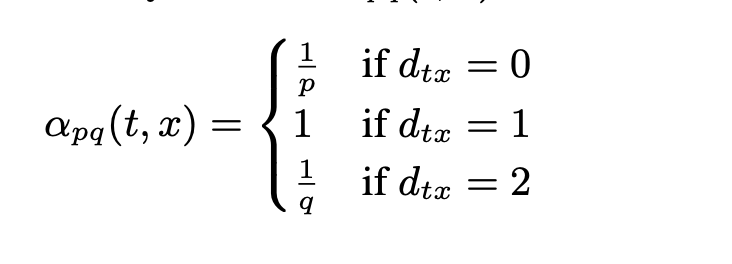
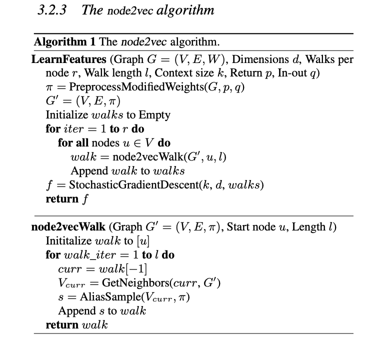

\begin{center}

\textbf{Abstract}

Record linkage is the process of relating entities within different datasets. The primary uses for record linkage is entity resolution, which allows for efficient joining between multiple heterogenous relations that do not have a clear discriminatory key and removes duplicates from a single relation. We look to represent this problem as an binary edge prediction problem on heterogenous graphs assuming that the dataset contains distinct pairs. Our approach involves converting datasets into graph embeddings, applying node2vec and training traditional machine learning models in order to find appropriate matches between datasets. This approach should enable sophisticated relationships between entities to be preserved. The result of our models currently lags behind the baseline however, it is approaching the baseline.

\end{center}

\Begin{multicols}{2}

# Introduction

Record linkage is the process of relating entities within different datasets. An example of record linkage at a University would be relating the students within a department to the students within a class. This is made trivial by the fact that the school designates a distinct ID to each student. However, without this primary key, the task would become about using the features associated with each entry to relate the entities within each dataset.

Our framework will look to represent this machine learning problem as an edge prediction problem on a heterogeneous graph. Although the record linkage problem can be used between entities within the same relation, we will focus primarily on the task of joining two distinct relations. The reason for this is that it constrains the problem statement, allowing us to focus on the methodology before seeking for a generalizable solution. Our heterogeneous graph representation will essentially be layers of graphs.

We believe that the graphical representation will improve on traditional models of record linkage, because it allows for the expression of more complicated relationships between entities that a tabular model may not able to represent. Also, a graphical model is more modular, thus allowing for development within this project to be more easily generalizable. An example of how a graphical approach improves on a tabular is that adding multiple relations to the graph becomes more natural. Similarly, feature representation within a graphical framework is more flexible, such as representing an address based on its subparts (address, city, state, zip code). This allows for matching even in cases that there are errors within the relation, such as incorrect spelling or missing data.

The graphical approach also allows us to leverage previous research within the field, such as using the techniques described in node2vec. An example could be using the idea of negative sampling to improve the size of the training data.

# Methods

## Overview

The pipeline for our model can be fundamentally broken down into 3 major steps: (1) Graph Embedding, (2) Node2Vec, and (3) a traditional machine learning model. The goal of the graph embeddings is to take the data presented within a tabular format, and embed it within a heterogenous graph structure where the nodes represent the entities within the dataset and the features of the dataset. For example, in our implementation, we assigned a unique key to each row of the datasets. These key nodes would then form undirected edges to the features associated to that row within the dataset. The Node2Vec would allow us to embed the nodes of the heterogenous graph within an Euclidean that allows for a more natural mathematical interpretation of similarity.

Lastly, this embedding is used as a feature representation for a traditional machine learning model. We think that the record linkage problem should be seen as a binary task in which the goal is predict whether two entities are the same. Framing this problem as a binary task allows for a scalable and tractable framework for this task.

## Graph Embedding

For our graph embedding model, we embedded the tabular data into a heterogenous graph.

In our heterogenous graph, there are 3 subgraphs to store: $G_{E}$, $G_{EA}$, and $G_{AA}$, which correspond to entity to entity, entity "is a" attribute, and attribute to attribute. In the medical record dataset, $G_{E}$ is readily defined with ground truth labels already - we can create a matrix with an entry of 1 if row i and column j represent the same entities and 0 otherwise. $G_{EA}$ can best be defined for sex - we can create a matrix with an entry of 1 if row i and column j are in agreement of the sex label and 0 otherwise. $G_{AA}$ will likely comprise of the date of birth and name data, since those day/month/year of birth and first name / last name columns are naturally interconnected.

### Ordinal and Categorical Columns

In order to embed ordinal and categorical columns, we naturally treated these columns as dicrete values. For example, for the textual analysis, we used a bagofwords approach in which each word is tokenized and embedded as discrete values. For example, the sentence 'A blue car' would mean that the entity creates an edge to 'a', 'blue', and 'car' nodes. In the effort of not allowing the size of our graph to explode, we removes words that were highly common by creating a cap on document frequency of any token in our vocabulary. In the example of textual embedding, we believe that a bag of words approach is reasonable. Our task is in principle pattern matching, therefore the content of the text is naturally more useful than the sentiment or syntax of the text.

### Quantitative Columns

For the quantitative columns, there is no natural notion of discrete values. For example, we used a column for prices. If we treated this as discrete values, there would be an unreasonably large amount of nodes within the graph and the mathemtical notion of proximity would be lost. For example, the prices $17 and $18 would be as equally close as the prices $20 and $30 if treated as discrete values. In order to remedy this issue, we struck a balance by binning our quantitative columns. This allows us to have a discrete representation while still preserving the notion of mathematical "closeness".

## Node2Vec

Once we have the graphical embedding of our datasets, we used the node2vec model in order to create a feature representation. The Node2Vec algorithm is originally proposed by Aditya Grover and Jure Leskovec of Stanford University. It heavily relies on the idea of Word2Vec, which attempts to embed text into a Euclidian space based on the context that that word tends to be used.

For a node $n$, the goal is to learn a embedding $f(n)$, such that it maximize the probability of the context for that node, expressed as $N_{S}(n)$. The loss function can be expressed as:

$$\max_{f} \Sigma log(P(N_{S}(n)|f(n))$$

In practical terms, this means that if two nodes are presented within a similar context, then the output of the embedder, $f(n)$ should produce similar embeddings. Though this method was originally built for word embedding, where the sentences are treated as the context for the words, the same framework can be extended to graphs by representing paths as stand-ins for a sentences.

A flaw, however, is that there is no natural understanding of the what consitutes a reliable sample of paths within a graph. The node2vec arhictecture answers this issue with the idea of a parameterized random walk. This is essentially a method for sampling a path by creating a probability distribution parameterized by p (controlling the likelihood of returning to previous node), and q (controlling of how far to move away from current node)

{ width=50%}

This sampling algorithm can be thought of as a hybrid of the traditional graph traversal algorithms, DFS and BFS. An example of this is below.

{ width=50%}

We believe that the Node2Vec algorithm is appropriate for our task, because of the intuition that two entities where the ground-truth is that they are the same should have a similar environment within the graph.

## Traditional ML Model

The last step is the training of a binary model. In this step, we utilized traditional machine learning models. The two models we experimented with are Support Vector Machines (SVM) and Boosted Decision Trees, specifically AdaBoost.

Lastly, the feature representation of the entity nodes
 - describe the ideas of why we use the basic ML algorithms
 - decribe each algorithm, the math of it, and then the pros/cons of each algos

### Support Vector Machine

A Support Vector Machine (SVM) is a machine learning algorithm originally developed in 1963 by Vladimir Vapnik in which the the goal is to solve the optimization problem (where W is the margin between the support vectors, and $\zeta_i$ is the slackness parameter):

$$minimie \,  (1/n)\,\sum_{i=1}^{n} \zeta_{i}\, + \lambda \, \|W\|$$
$$Subjuct \, to \, y_{i}(w * x_{i} - b) > 1 - \zeta_{i}$$

A SVM classifier attempts to find the decision boundary that maximizes the distance to the closest data point from each class, which is also considered a support vector. Because the data may not linearly seperable, kernels and the slackness parameter can be used to increase the performance of the model.

### Boosted Decision Trees

We also wanted to train a boosted decision trees. In this case, we choose the AdaBoost algorithm, which was developed by Robert Schapire and UCSD professor Yoav Freud in 2003. The motivation for using this algorithm is that it tests out of the pipeline with a decision tree algorithm, and boosted trees tend to have positive properties of being difficult to overfit.

## Hyperparameters

A major component of our pipeline is an inordinate amount of hyperparameter tuning throughout our pipeline. Within the graph embedding step, there are hyperparameters associated with the textual embedding and quantitiative binning. Likewise, in the Node2Vec algorithm, there are hyperparameters for the sampling strategy and output vector size. Lastly, there are hyperparameters for our traditional machine learning models.

A shortlist of hyperparameters associated with our model is:

 - Text Embedding Maximum Document Frequency
 - Number of Bins for Quantitative feature embedding
 - Node2vec Q value
 - Node2vec P value
 - Node2vec Output Vector Size
 - Node2Vec Walk Length
 - Node2Vec Number of Walks Taken
 - Node2Vec Negative Sampling Rate
 - SVM C value

This large amount of hyperparameters make it difficult to gauge the results of our model and to debug the pipeline.

\End{multicols}
\pagebreak

| Dataset        | Model           | Training Accuracy  | Test Accuracy  | Baseline Accuracy
| :-------------: |:-------------:| :-----:| :-----:| :-----:|
| Abt-Buy      | SVM | 97% | 73% | 92% |
| -      | AdaBoost      |   78% | 72% | - |
| DBLP-ACM      | SVM | - | - | - |
| -      | AdaBoost      |   - | - | - |
| DBLP-Scholars      | SVM | - | - | - |
| -      | AdaBoost      |   - | - | - |
| Amazon-Google Products      | SVM | - | - | - |
| -      | AdaBoost      |   - | - | - |
| Author Report      | SVM | - | - | - |
| -      | AdaBoost      |   - | - | - |

\Begin{multicols}{2}

# Results

## Emperical Results

The emperical results show so far our pipeline is able to perform close to the performance of the baseline model, but is still considerably lagging behind. It is currently difficult to interpret whether these results are due to a flaw within the model or due to improper hyperparameter tuning.

**Will place more information as results come in and fill out table as more information comes in**
**Will also show information about hyperparameter tuning as results come in**

# Discussion

While we have not obtained major empirical results with our approach yet, we that this is a well-formed method of tackling record linkage. So far, we have results on a small test dataset that shows progress made using our techniques. Prior work in this space has included heterogeneous information networks, but use other methods such as linguistic and natural language processing methods to see if two instances co-refer to the same entity or use other mathematical models such as Bayesian Networks. In comparison, we use a context-based approach, as we believe this can represent hidden complexities and semantics within our graph in a way that other approaches do not. Our results can have an impact in both industry and academia, as joining large datasets becomes an increasingly common problem within this era of “big data.” The methods we used should be broadly applicable to any dataset, as our methods are laid out in a general sense. Our work can also be used as a starting point for researchers that are interested in using context-based approaches for entity recognition (approaches that are perhaps not node2vec).

Even though we do not have all of the results of the model yet, we can still look at ways to improve what we have accomplished. There are limitations in our method and there are many improvements that can be made. In creating features with our graph embeddings, we can opt to use more complex techniques, such as using natural language processing approaches rather than bag-of-words. Representing qualitative data can also be improved – for example, there can be “closeness” thresholds and metrics that can determine whether qualitative variables from different instances can be from the same entity. These types of improvements can give a richer representation of the data to the machine learning model and thus, output better results. Hyperparameter tuning is another aspect of our work that can be improved – we note that there are several parameters to tune, beginning at the graph embedding level when we make the features to the machine learning level, where we choose parameters for our models. Clearly, there are aspects that can be manipulated and tweaked at each level, which may improve performance.

\End{multicols}

\pagebreak

# References

1. https://ajph.aphapublications.org/toc/ajph/36/12
2. https://science.sciencemag.org/content/130/3381/954
3. https://www.tandfonline.com/doi/abs/10.1080/01621459.1969.10501049
4. https://aspe.hhs.gov/report/studies-welfare-populations-data-collection-and-research-issues/two-methods-linking-probabilistic-and-deterministic-record-linkage-methods
5. http://ceur-ws.org/Vol-1272/paper_17.pdf
6. https://archive.ics.uci.edu/ml/datasets/Record+Linkage+Comparison+Patterns?fbclid=IwAR1dLbJZGVJ4at79aw4hm8TC0-zWOduLXJA8G9tqbgpWwmYimnk-mPMAnUg
7. https://www.ncbi.nlm.nih.gov/pmc/articles/PMC3039555/
8. https://pdfs.semanticscholar.org/2404/eb5760ec2925c075c7968c845d2cc6fda73b.pdf
9. http://sites.bu.edu/jbor/files/2018/10/Building-the-Cohort-10oct2018-1.pdf
10. https://www.cse.ust.hk/~yqsong/papers/2017-KDD-HINDROID.pdf
11. https://cs.stanford.edu/~jure/pubs/node2vec-kdd16.pdf
12. https://link.springer.com/content/pdf/10.1007%2F978-3-540-69534-9_41.pdf
13. http://www.dit.unitn.it/~p2p/RelatedWork/Matching/713.pdf

# Appendix

Node2Vec Implementation We Used: https://github.com/aditya-grover/node2vec

{ width=50% }

\pagebreak

### Revision to the Proposal

No revisions.

### Backlog:

- For Checkpoint 1:
	- All members - revised proposal
	- Udai: Create code for generating datasets with strong keys (and varying noise)
	- Shinu: Clean and perform EDA on our real-world datasets
	- Wesley: Finalize Structure of our Heterogenous Graphs
		- determine method for representing graphs (on disk)
		- determine method for using quantitative attributes.

- For Checkpoint 2:
	- Generate Heterogenous Graphs (Udai)
	- Train baselines Models (Wesley)
		- perform tests over a subset of generated datasets
	- Clean real dataset and transform in a usable format (Shinu)
	- Stretch Goal: Train/Evaluate Hindroid Model using our data (everyone)

- For checkpoint 3:
	- Generate Heterogenous graphs for Author Disambiguation dataset. (Shinu)
	- Train and evaluate Hindroid model on the datasets. (Everyone)
	- Finalize elevator pitch (Everyone)
	- Finalize visual presentation (Everyone)

- For Final Submission:
	- Train models on the smaller datasets (especially DBLP ones) (Shinu / Wesley)
  - Create graphs and train models on Author Disambiguation dataset (everyone)
  - Obtain final results for all models and update report (everyone)
