\begin{center}

\textbf{Abstract}

Record linkage is the process of relating entities within different datasets. The primary use for record linkage is entity resolution, which allows for efficient joining between multiple heterogenous relations that do not have a clear discriminatory key and removes duplicates from a single relation. We look to represent this problem as an binary edge prediction problem on heterogenous graphs assuming that the dataset contains distinct pairs. Our approach involves converting datasets into graph embeddings, applying node2vec and training traditional machine learning models in order to find appropriate matches between datasets. This approach should enable sophisticated relationships between entities to be preserved. Our results demonstrate that our model lags behind a naive baseline model, in that our model only surpasses the baseline model for a single dataset. However, we also found that our model tends to beat the naive model as our datasets scale up with our model achieving an accuracy of 79% compared to the 59% for the baseline.

\end{center}

# Introduction

Record linkage is the process of finding records across different data sets that correspond to the same entity. An example of record linkage at a university would be relating the students within a department to the students within a class. This is made trivial by the fact that the school designates a distinct ID to each student. However, without this primary key, the task would become about using the features associated with each entry to relate the entities within each dataset.

Our framework will look to represent this machine learning problem as an edge prediction problem on a heterogeneous graph. Although the record linkage problem can be used between entities within the same relation, we will focus primarily on the task of joining two distinct relations. The reason for this is that it constrains the problem statement, allowing us to focus on the methodology before seeking for a generalizable solution. Our heterogeneous graph representation will essentially be layers of graphs.

We believe that the graphical representation will improve on traditional models of record linkage, because it allows for the expression of more complicated relationships between entities that a tabular model may not able to represent. Also, a graphical model is more modular, thus allowing for development within this project to be more easily generalizable. An example of how a graphical approach improves on a tabular is that adding multiple relations to the graph becomes more natural. Similarly, feature representation within a graphical framework is more flexible, such as representing an address based on its subparts (address, city, state, zip code). This allows for matching even in cases that there are errors within the relation, such as incorrect spelling or missing data.

The graphical approach also allows us to leverage previous research within the field, such as using the techniques described in Node2Vec. An example could be using the idea of negative sampling to improve the size of the training data.

# Methods

## Overview

The pipeline for our model can be fundamentally broken down into 3 major steps: (1) Graph Construction, (2) Node2Vec, and (3) a traditional machine learning model. The goal of the graph construction is to take the data presented within a tabular format, and embed it within a heterogenous graph structure where the nodes represent the entities within the dataset and the features of the dataset. For example, in our implementation, we assigned a unique key to each row of the datasets. These key nodes would then form undirected edges to the features associated to that row within the dataset. Node2Vec would allow us to embed the nodes of the heterogenous graph within an Euclidean space that allows for a more natural mathematical interpretation of similarity.

Lastly, the graph embedding from Node2Vec is used as a feature representation for a traditional machine learning model. We think that the record linkage problem should be seen as a binary task in which the goal is predict whether two entities are the same. Framing this problem as a binary task allows for a scalable and tractable framework for this task.

## Graph Construction

For our graph construction, we represent the tabular data into a heterogenous graph by translating each columns into discrete tokens.

In our heterogenous graph, there are 3 subgraphs to store: $G_{EE}$, $G_{EA}$, and $G_{AA}$, which correspond to entity to entity, entity "is a" attribute, and attribute to attribute. In the figure below, there is an example of a $G_{EA}$, in which we have a unique entity node associated to a sample of attribute nodes. In the context of this problem, we would be treating $G_{EE}$ as being the ground-truth on which we are making our edge predictions. An edge would be formed between entities in the $G_{EE}$ in the case that those 2 entities represent the same object.

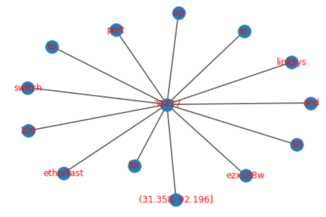{ width=50%}

### Ordinal and Categorical Columns

In order to embed ordinal and categorical columns, we naturally treated these columns as discrete values. For example, for the textual analysis, we used a bag-of-words approach in which each word is tokenized and embedded as discrete values. For example, the sentence 'A blue car' would mean that the entity creates an edge to 'a', 'blue', and 'car' nodes. In the effort of not allowing the size of our graph to explode, we removes words that were highly common by creating a cap on document frequency of any token in our vocabulary. This document frequency cap ignores the words that show up in a large number of entities, thus likely being less predictive. In the example of textual embedding, we believe that a bag of words approach is reasonable. Our task is in principle pattern matching, therefore the content of the text is naturally more useful than the sentiment or syntax of the text. An example of textual embedding can be seen in the figure below.

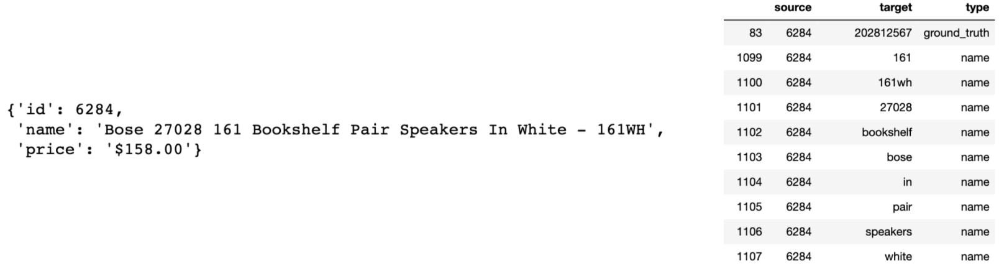{ width=70%}

### Quantitative Columns

For the quantitative columns, there is no natural notion of discrete values. For example, we used a column for prices. If we treated this as discrete values, there would be an unreasonably large amount of nodes within the graph and the mathematical notion of proximity would be lost. For example, the prices $17 and $18 would be as equally close as the prices $20 and $30 if treated as discrete values. In order to remedy this issue, we struck a balance by binning our quantitative columns. This allows us to have a discrete representation while still preserving the notion of mathematical "closeness".

We experimented with two strategies for binning:
1. equal-length bins
2. equal-density bins

The 'equal-length bins' is essentially equivalent to following a histogram approximation of the quantitative variable. This naturally has the downside of creating bins that are very dense and very sparse. The 'equal-density bins' allows for the formation of *k* bins where the bins are restricted to having an equal amount of data points. The goal of this is that it resolves the issue of sparse bins; however, the bounds of the bins are determined from the training data, which means that this method theoretically requires a higher amount of quality data to perform well.

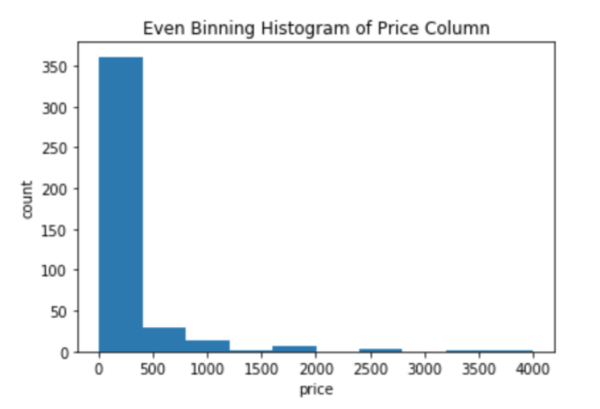{ width=50%}

## Node2Vec

Once we have the graphical embedding of our datasets, we used the node2vec model in order to create a feature representation. The Node2Vec algorithm is originally proposed by Aditya Grover and Jure Leskovec of Stanford University. It heavily relies on the idea of Word2Vec, which attempts to embed text into a Euclidian space based on the context that that word tends to be used.

For a node $n$, the goal is to learn a embedding $f(n)$, such that it maximize the probability of the context for that node, expressed as $N_{S}(n)$. The loss function can be expressed as:

$$\max_{f} \Sigma log(P(N_{S}(n)|f(n))$$

In practical terms, this means that if two nodes are presented within a similar context, then the output of the embedder, $f(n)$ should produce similar embeddings. Though this method was originally built for word embedding, where the sentences are treated as the context for the words, the same framework can be extended to graphs by representing paths as stand-ins for a sentences.

A flaw, however, is that there is no natural understanding of the what constitutes a reliable sample of paths within a graph. The node2vec architecture answers this issue with the idea of a parameterized random walk. This is essentially a method for sampling a path by creating a probability distribution parameterized by p (controlling the likelihood of returning to previous node), and q (controlling of how far to move away from current node)

{ width=40%}

This sampling algorithm can be thought of as a hybrid of the traditional graph traversal algorithms, DFS and BFS. An example of this is below.

{ width=40%}

We believe that the Node2Vec algorithm is appropriate for our task, because of the intuition that two entities where the ground-truth is that they are the same should have a similar environment within the graph. For example, in the figure below, the two embeddings share similar features, such as 'Linksys' and 'switch'. Therefore, we can expect the 'community' that is found by the Random Walk algorithm to be more similar between these two nodes than a random sample of nodes.

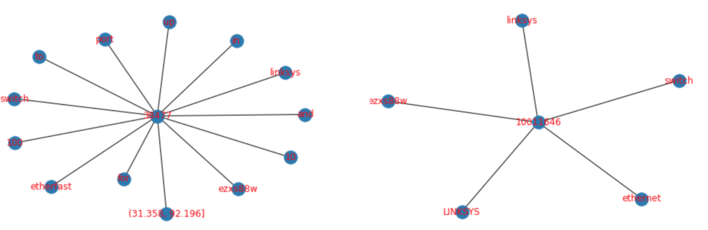{ width=40%}

## Traditional ML Model

The last step is the training of a binary model. In this step, we utilized traditional machine learning models. The two models we experimented with are Support Vector Machines (SVM) and Boosted Decision Trees, specifically AdaBoost.

### Support Vector Machine

A Support Vector Machine (SVM) is a machine learning algorithm originally developed in 1963 by Vladimir Vapnik in which the goal is to solve the optimization problem (where W is the margin between the support vectors, and $\zeta_i$ is the slackness parameter):

$$minimie \,  (1/n)\,\sum_{i=1}^{n} \zeta_{i}\, + \lambda \, \|W\|$$
$$Subjuct \, to \, y_{i}(w * x_{i} - b) > 1 - \zeta_{i}$$

A SVM classifier attempts to find the decision boundary that maximizes the distance to the closest data point from each class, which is also considered a support vector. Because the data may not linearly separable, kernels and the slackness parameter can be used to increase the performance of the model.

### Boosted Decision Trees

We also wanted to train a boosted decision trees. In this case, we choose the AdaBoost algorithm, which was developed by Robert Schapire and UCSD professor Yoav Freud in 2003. The motivation for using this algorithm is that it tests out of the pipeline with a decision tree algorithm, and boosted trees tend to have positive properties of being difficult to overfit.

## Hyperparameters

A major component of our pipeline is an inordinate amount of hyperparameter tuning throughout our pipeline. Within the graph embedding step, there are hyperparameters associated with the textual embedding and quantitative binning. Likewise, in the Node2Vec algorithm, there are hyperparameters for the sampling strategy and output vector size. Lastly, there are hyperparameters for our traditional machine learning models.

A shortlist of hyperparameters associated with our model is:

 - Text Embedding Maximum Document Frequency
 - Number of Bins for Quantitative feature embedding
 - Node2vec Q value
 - Node2vec P value
 - Node2vec Output Vector Size
 - Node2Vec Walk Length
 - Node2Vec Number of Walks Taken
 - Node2Vec Negative Sampling Rate
 - SVM C value
 - Number of Estimators (for AdaBoost)

This large amount of hyperparameters make it difficult to gauge the results of our model and to debug the pipeline.

The maximum document frequency and number of bins affect how the original dataset is represented in the graph construction. This affectively acts as a determination of what representation maximizes the signal while allowing for limited noise. For example, if we allowed all textual tokens to be represented, we are introducing many simple words like "the", "a", "and" that are affectively noise. On the flip side, removing too many terms may remove terms that are highly predictive. Likewise, with a quantitative variable, the choice of the number of bins dictates how precise we want our representation to be in order.

For Node2Vec, the hyperparameters dictate the size of our embedding space and a parameterized definition of a neighborhood. For example, the p and q hyperparameters control the random steps being taken in the *Random Walk* algorithm. Similarly, the walk length controls for the relative size of the neighborhood. Therefore, by changing these values, we are modifying our definition of what a 'neighborhood' means within the context of a graph.

Lastly, the SVM's C value and AdaBoost's number of estimators represents the bias-variance trade-off for our model. In other terms, these hyperparameters control the tension between fitting the training data and making the model be generalizable to new data.

# EDA

## Datasets

For this project, we are going to be using a large dataset from [Kaggle](https://www.kaggle.com/c/kdd-cup-2013-author-disambiguation/rules) and four smaller datasets from [Leipzig Universities Database Department](https://dbs.uni-leipzig.de/research/projects/object_matching/benchmark_datasets_for_entity_resolution). The goal is to analyze the smaller datasets from Leipzig university in order to verify the validity of our implementation, as well as resolve the glaring issues that may arise within the model.

## Author Disambiguation Dataset

The Author Disambiguation Dataset from [Kaggle](https://www.kaggle.com/c/kdd-cup-2013-author-disambiguation/rules) is a group of five datasets that were provided by Microsoft Corporation from their Microsoft Academic Search Database in order to try to find ways to solve disambiguation problems present in datasets.

The five datasets are:
1. Author dataset (Author.csv)
This dataset contains information on publication authors in the Academic Search Database. It contains Author ID, name and affiliation of the author.
Number of instances - 247,203
2. Paper dataset (Paper.csv)
The paper dataset contains information on the papers available in the Academic Search Database. It contains Paper ID, Title of the paper, Year published, Conference ID, Journal ID and keywords. The dataset is very noisy with the possibility of the same paper appearing multiple times in the dataset as it may have been obtained through different data sources.
Number of instances - 2,257,249
3. Paper-Author Dataset (PaperAuthor.csv):
The paper author dataset contains paper id and author id pairs. The dataset is very noisy as it contains possibly incorrect paper-author assignments due to author name ambiguity and variations of author names.
Number of instances - 12,775,821
4. Journal and Conference dataset (Journal.csv, Conference.csv):
These datasets contain additional metadata on the papers dataset. Each paper can be either a conference or journal and some of the paper may not be associated with either.
Number of instances in the journal dataset - 4,545
Number of instances in the conference dataset - 15,151

The paper, author and paper-author datasets, that are very important for our problem, varying degrees of missingness for each of its columns.

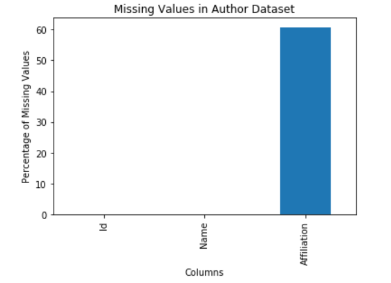{ width=25% }

As shown by the above bar chart, the authors dataset has the highest number of missing values(60%) in the affiliation column. The name column comes in second with only 7 percent of its data missing. The ID column has no missing values.

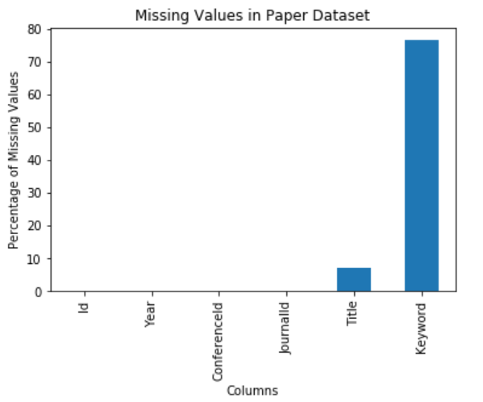{ width=25% }

The paper dataset has the highest number of missing values(76%) in the keyword column. The title column has the second highest number of missing values with 7% of its data missing. The other columns do not have any missing values.

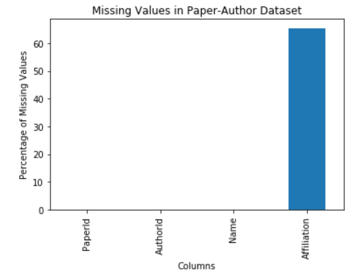{ width=25% }

The affiliation column in the paper-author dataset has the highest number of missing values(65%). The only other column in the dataset that has any missing values is Name. Only 0.002 percent of the Name attribute is missing.

The missing values in the columns will play large part as more missing values result in it being harder to classify a link between records.

## Smaller Datasets

### Introduction

The four smaller datasets that we will be looking at are from [Leipzig Universities Database Department](https://dbs.uni-leipzig.de/research/projects/object_matching/benchmark_datasets_for_entity_resolution). Each dataset is sampled from real world examples and the noise in each one varies differently. These datasets are primarily used as benchmarks for testing different entity resolution techniques hence, they will be ideal to evaluate our model. In particular, two of these datasets are directly associated with the Author Disambiguation Dataset we will be using for our final implementation, as these datasets deal with linking books and authors. The following datasets following a similar format, comprising of two separate datasets and a file that describes the matching entities between the two datasets.

### Abt-Buy

This dataset is two separate datasets of with 1081 and 1092 instances of purchasable items with names and description, but without a clear link between the two datasets. Most of the data within this dataset is textual, apart from a price column. However, the price column is the most dirty column in that it has NaN values. There is also an issue with the fact that the description column within the Buy dataset seems to also have many missing values. This intuitively gives means that the meaningful connections must be made between the description and the name columns.

| About Table NaN's      | Buy Table NaN's          |
| ------------- |:-------------:|
| { width=25% }     | 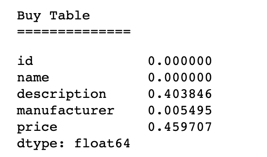{ width=25% }|

There is also some ambiguity within the dataset. For example, there is a few examples within the dataset in which multiple entities are matched. Within this case, we want our recording linkage algorithm to be able to find that the entities are similar enough rather than being confused by the small differences. In other words, we want our record linkage algorithm to be invariant to such noise within the data.

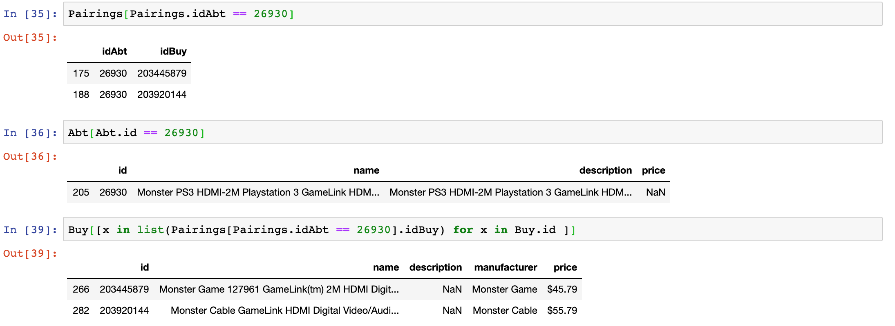{ width=45% }

### DBLP-ACM

This dataset comprises of two datasets: one with 2614 entries and one with 2294 entries. Both datasets contain columns with unique IDs, titles of books, authors, venue, and year. Aside from the year, the data in these two datasets is textual. Between the 2 datasets, there are 2224 ground truth matches. This dataset is extremely clean, with very little missingness. The only form of missingness arises from the authors column in one of the datasets, with 0.06% of data missing. A quick EDA through the matches also shows that this dataset only has 1-to-1 links between the two datasets.

{ width=45% }

### DBLP-Scholars

Similar to the DBLP-ACM dataset, this is a dataset with books, authors, and venues. One dataset contains 2616 entries while the other contains 64,263 entries - this is notably larger than the previous dataset. As with the DBLP-ACM dataset, both datasets in this dataset contains IDs, titles of books, authors, venue, and year. However, unlike the previous dataset, this one contains a high degree of missingness, particularly in the venue and year columns, which makes it difficult to utilize those columns in creating useful features to link entities between the two datasets together. Performing entity resolution in this dataset will require use of primarily the title and authors columns.

| DBLP Table NaN's      | Scholar Table NaN's          |
| ------------- |:-------------:|
| { width=25% }     | { width=25% }|

With this dataset, there are 5347 ground truth matches. Unlike the previous dataset, there are many 1-to-many links between entities, though this should be clear as there are almost twice as many matches as entities in one of the datasets.

### Amazon-Google Products

This dataset is similar to the Abt-Buy dataset, containing two datasets, one from Amazon and one from Google, where each row is a product. The Amazon dataset contains 1363 entries, while the Google dataset contains 3226 entries. Each dataset has columns with IDs, titles/names of products, description of the product, manufacturer, and price. In the Google dataset, there's a high number of missing values in the manufacturer column (nearly all of it is missing).

| Amazon Table NaN's      | Google Table NaN's          |
| ------------- |:-------------:|
| { width=25% }     | { width=25% }|

Like the Abt-Buy dataset, the majority of the data is textual, with the exception of price. The main objective to perform entity linkage would be perform text processing methods on the description columns. In this dataset, there are 1300 ground truth matches, with 1113 unique Amazon IDs and 1291 unique Google IDs, meaning there are 1-to-many entity matches. Unlike the book/author datasets, the titles/names of products between the two datasets rarely match each other exactly, which again reinforces the intuition that the description column would have to be heavily utilized to perform effective entity resolution.

\pagebreak

| Dataset        | Model           | Test Accuracy  | Baseline Accuracy | Test Precision | Test Recall |
| :-------------: |:-------------:| :-----:| :-----:| :-----:|:-----:|
| Abt-Buy                | SVM      | 73% | 92% | 82% | 66% |
| -                      | AdaBoost | 78% | - | 79% | 76% |
| DBLP-ACM               | SVM      | 81% | 100% | 80% | 82% |
| -                      | AdaBoost | 73% | - | 63% | 81% |
| DBLP-Scholars          | SVM      | 71% | 73% | 73% | 69% |
| -                      | AdaBoost | 65% | - | 62% | 69% |
| Amazon-Google Products | SVM      | 74% | 51% | 70% | 80% |
| -                      | AdaBoost | 65% | - | 62% | 70% |
| Author Report          | SVM      | 79% | 59% | 80% | 74% |
| -                      | AdaBoost | 71% | - | 72% | 70% |

*Note: the test set used for the baseline model and our model was the same set of samples.*

# Results

## Emperical Results

The emperical results show so far our pipeline is able to perform close to the performance of the baseline model, but is still considerably lagging behind. It is currently difficult to interpret whether these results are due to a flaw within the model or due to improper hyperparameter tuning.

We found that our model performed on par or worse than the baselines models for most of the smaller datasets. However, our model outperformed the baseline models on the Amazon-Google Products, and more importantly, on the Author Report dataset. This seems to indicate that the performance of our model tends to scale well to larger datasets. This is a positive sign, as this may indicate that our approach is empirically viable, but requires higher amount of data than the traditional model.

Also, we found that the SVM as the final classifier performs much better than the AdaBoost classifer.

## Node2Vec Embeddings

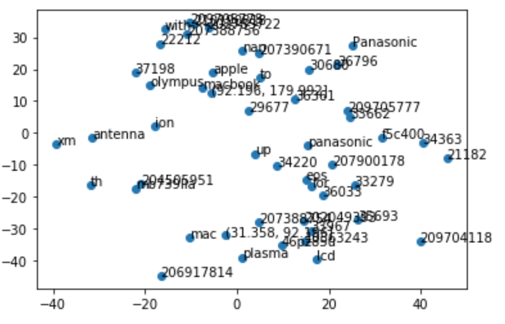{ width=50% }

Much of our method hinges on the idea that rows that are of the same object within each table will have a similar community of features. Because of this is supposed similar community, the node2vec algorithm will project nodes of similar objects into a similar vector (similarity would be based on Euclidean distance). However, much of hinges on the sampling pattern within the Node2vec algorithm that defines the samples of such communities. Although our assumption is theoretically supported, the effectiveness is unclear.

Figure 12 shows the embeddings of 500 randomly sampled terms. The embeddings were originally into a 500-dimensional space, but then projected into a two dimensional space using t-SNE. It is inherently difficult to validate whether this embedding is reasonable. However, an example to look towards is that the terms 'Apple' and 'Macbook' are fairly close to each other. Although this may be randomness, it indicates that there is a logic interpretation of the embeddings.

Similarly, Figure 13 is an example of 500 random terms with the t-SNE projection into 2 dimensions. Visually, there doesn't seem to be any inherent forming. However, it is unclear whether clusters should be expected because there isn't a defined discrete groupings within the set of terms projected. So, from visual inspection, it is unclear whether this indicates the effectiveness of the node2vec algorithm for this problem.

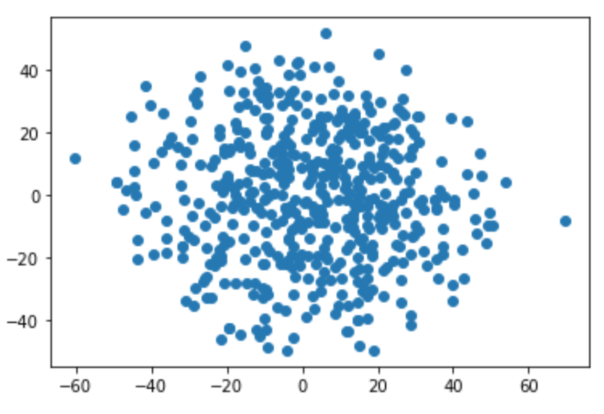{ width=50
% }

# Discussion

Even though our model results are not ideal, we believe that this is a well-formed method of tackling record linkage. Our results on the small test datasets as well as the author disambiguation dataset shows progress made using our techniques. Prior work in this space has included heterogeneous information networks, but use other methods such as linguistic and natural language processing methods to see if two instances co-refer to the same entity or use other mathematical models such as Bayesian Networks. In comparison, we use a context-based approach, as we believe this can represent hidden complexities and semantics within our graph in a way that other approaches do not. Our results can have an impact in both industry and academia, as joining large datasets becomes an increasingly common problem within this era of “big data.” The methods we used should be broadly applicable to any dataset, as our methods are laid out in a general sense. Our work can also be used as a starting point for researchers that are interested in using context-based approaches for entity recognition (approaches that are perhaps not node2vec).

Looking at our results, we can see that there are many ways to improve what we have accomplished. There are limitations in our method and there are many improvements that can be made. In creating features with our graph embeddings, we can opt to use more complex techniques, such as using natural language processing approaches rather than bag-of-words. Representing qualitative data can also be improved – for example, there can be “closeness” thresholds and metrics that can determine whether qualitative variables from different instances can be from the same entity. These types of improvements can give a richer representation of the data to the machine learning model and thus, output better results. Hyperparameter tuning is another aspect of our work that can be improved – we note that there are several parameters to tune, beginning at the graph embedding level when we make the features to the machine learning level, where we choose parameters for our models. Clearly, there are aspects that can be manipulated and tweaked at each level, which may improve performance.

\pagebreak

# References

# References

Boghdady, Mahmoud, and Neamat El-Tazi. “A Novel Record Linkage Methodology Based on Graph Interactions.” Department of Computers and Information, Cairo University, Giza, Egypt, 2017, pdfs.semanticscholar.org/2404/eb5760ec2925c075c7968c845d2cc6fda73b.pdf.

Bor, Jacob, et al. “Building a National HIV Cohort from Routine Laboratory Data: Probabilistic Record-Linkage with Graphs.” Department of Global Health, Boston University School of Public Health, 10 Oct. 2018, sites.bu.edu/jbor/files/2018/10/Building-the-Cohort-10oct2018-1.pdf.

Dunn, Halbert  L. “The American Journal of Public Health (AJPH) from the American Public Health Association (APHA) Publications.” American Public Health Association (APHA) Publications, Dec. 1946, ajph.aphapublications.org/doi/10.2105/AJPH.36.12.1412.

Fellegi, Ivan, and Alan Sunter. “A Theory for Record Linkage.” Taylor &amp; Francis, 10 Apr. 2012, www.tandfonline.com/doi/abs/10.1080/01621459.1969.10501049.

Finney, John M, et al. “An Efficient Record Linkage Scheme Using Graphical Analysis for Identifier Error Detection.” BMC Medical Informatics and Decision Making, BioMed Central, 1 Feb. 2011, www.ncbi.nlm.nih.gov/pmc/articles/PMC3039555/.

Newcombe, H. B., et al. “Automatic Linkage of Vital Records.” Science, American Association for the Advancement of Science, 16 Oct. 1959, science.sciencemag.org/content/130/3381/954.

Grover, Aditya, and Jure Leskovec. "node2vec: Scalable Feature Learning for Networks." Department of Computer Science, Stanford Univeristy, 2016,cs.stanford.edu/jure/pubs/node2vec-kdd16.pdf

Hou, Shifu, and Yanfang Ye. “HinDroid: An Intelligent Android Malware Detection System Based on Structured Heterogeneous Information Network.” Department of Computer Science &amp; Engineering, Hong Kong University of Science and Technology, 2017, www.cse.ust.hk/~yqsong/papers/2017-KDD-HINDROID.pdf.

Ioannou, Ekaterini, et al. “Probabilistic Entity Linkage for Heterogeneous Information Spaces.” L3S Research Center/Leibniz Universit¨at Hannover, 2008, link.springer.com/content/pdf/10.1007%2F978-3-540-69534-9_41.pdf.

Kejriwal, Mayank, and Daniel P. Miranker. “On Linking Heterogeneous Dataset Collection.” CEUR Workshop Proceedings, 21 Oct. 2014, ceur-ws.org/Vol-1272/paper_17.pdf.

Sleeman, Jennifer, et al. “Entity Type Recognition for Heterogeneous Semantic Graphs.” University of Trento, 2014, www.dit.unitn.it/~p2p/RelatedWork/Matching/713.pdf.

“Two Methods of Linking: Probabilistic and Deterministic Record-Linkage Methods.” ASPE, 16 June 2016, aspe.hhs.gov/report/studies-welfare-populations-data-collection-and-research-issues/two-methods-linking-probabilistic-and-deterministic-record-linkage-methods.

\pagebreak

# Appendix

Node2Vec Implementation We Used: https://github.com/aditya-grover/node2vec

{ width=50% }
