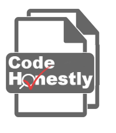

# CodeHonestly
### Utilize AST graphs to detect code plagiarism

`python run.py test-project` to run the project

Note 1: Please make sure there are at least two Python files in data folder, not any subfolder. It is functional out of box.

Note 2: We didn't wrap all the codes into library codes as possible because we might use the code in actual product that we don't want to release a version that 's easy for future development by others.

Website: https://www.codehonestly.com/

This project was founded in DSC 180B, a capstone project for data science undergraduate students at UCSD.
